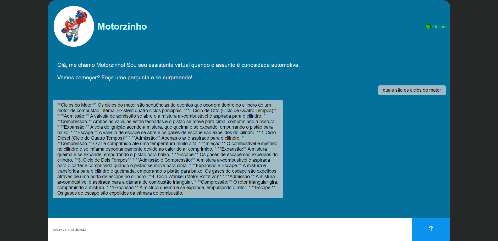

# Motorzinho
<h1 align="center">Motorzinho</h1>

 O Motorzinho é mais do que um simples chatbot - é um companheiro virtual que oferece assistência em uma variedade de tarefas e fornece respostas rápidas e precisas às suas perguntas sobre manutenção automotiva.  

  <a href="#-tecnologias">Tecnologias</a>&nbsp;&nbsp;&nbsp;|&nbsp;&nbsp;&nbsp;
  <a href="#-projeto">Projeto</a>&nbsp;&nbsp;&nbsp;|&nbsp;&nbsp;&nbsp;
  <a href="#memo-licença">Licença</a>

  

 

 
    

## 🚀 Tecnologias

-Nesse projeto foi utilizado as seguintes tecnologias:

-Gemini  
-CSS  
-HTML  
-JS  
-Github  

## 💻 Projeto

Esse chatbot é equipado com a inteligência artificial do gemini, ele está sempre pronto para fornecer informações úteis, orientações personalizadas e soluções adaptadas às suas necessidades específicas. Seja para questões simples do dia a dia ou para orientar em assuntos mais complexos, o Motorzinho está disponível para ajudar. Ele aprende com cada interação, tornando-se mais eficiente ao entender suas preferências. Além disso, o Motorzinho também pode oferecer diversão e entretenimento, contando piadas, sugerindo jogos e proporcionando momentos descontraídos sempre que necessário.

- Para ter acesso ao projeto, faça o clone do repositório e coloque sua chave da API do gemini.

Esse projeto está sob a licença MIT.

---

Feito com ♥ by Helena Lima

